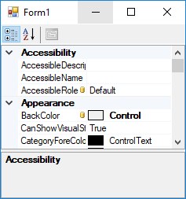

# Show data-binding glyph in PropertyGrid at run-time

When you bind a control property to a data source at design-time, the property grid shows a binding glyph near the property name on PropertyGrid, but at run-time you can not see that glyph.

In this example I've showed that glyph also in run-time:

To do so, you need to `IPropertyValueUIService` and then in property grid, for each entry which is presenting a property which is in data bindings collection, set an instance of the implemented `IPropertyValueUIService` as value of `pvSvc` private property of the `PropertyGrid`. This way, you can attach an event handler using `GetPropertyUIValueItems` to return the tooltip and image which you are going to show in front of the property.

Those values will be used in `PaintLabel` method of the property grid entry.
